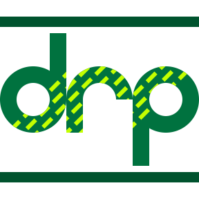

#### [Django REST Framework] + [pandas] = A Model-driven Visualization API

**Django REST Pandas** (DRP) provides a simple way to generate and serve [pandas] DataFrames via the [Django REST Framework].  The resulting API can serve up CSV (and a number of [other formats][formats] for consumption by a client-side visualization tool like [d3.js].

[**Django REST Pandas on GitHub**](https://github.com/wq/django-rest-pandas)

[pandas]: https://pandas.pydata.org/
[Django REST Framework]: https://www.django-rest-framework.org/
[formats]: ./renderers/index.md
[d3.js]: ./@wq/chart.md

## News

> This site is under construction.

## Documentation
